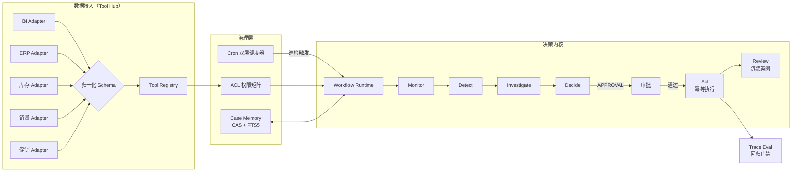

# 零售库存补货决策智能体

> 面向电商库存补货场景的**决策型 Agent**：以「定时巡检 → 异常调查 → 审批执行 → 案例复用」的完整闭环替代人工经验补货，把缺货与积压风险前置为**可追溯的决策证据**，人工只保留审批权与参数校准权。

- **零运行时依赖**：基于 Node 内置 `node:sqlite`（含 FTS5 全文检索），`npm install` 不触发 native 编译
- **离线确定性内核**：20 条本地 case 可离线 100% 复现，无 API Key、无随机性
- **可插拔 LLM 端口**：默认确定性内核，配置凭据即可切换到 OpenAI 兼容模型
- **单机可跑**：`npm run eval` 一键跑完 20 条 case + 回归门禁

---

## 核心能力

| 模块 | 解决什么 | 关键机制 |
|---|---|---|
| **库存数据 Tool Hub** | 多系统库存口径不一、缺货判断失真 | 统一 BI/ERP/库存/销量/促销 Adapter 为 JSON Schema，注册为按 SKU 授权的 MCP Tool，Session 工具面裁剪 |
| **补货 Workflow Runtime** | 人工补货凭经验、决策不可追溯 | Monitor→Detect→Investigate→Decide→Act→Review 六阶段可恢复 Turn，同 SKU 串行，审批后从 Checkpoint 恢复，幂等防重复执行 |
| **定时巡检调度器** | 人工巡检遗漏、市场突变反应慢 | Cron 双层模型：`next_run` 游标兼乐观锁、`occurrence_key` 幂等物化；重启后周期任务 missed 不补跑、一次性任务必达 |
| **审批权限 Harness** | AI 动作越权风险 | ACL 两维正交矩阵：查询/建议 AUTO，补货单/调价/下架 APPROVAL，删除 BLOCKED；admin 工作区层无旁路 |
| **补货 Case Memory** | 历史处置经验不复用 | 案例三段式 Schema，revision CAS 防并发覆盖，FTS5 trigram 按 SKU+时间窗召回 |
| **补货 Trace Eval** | 预测与决策不可复盘 | 六类故障样例，StreamEvent 记录 Tool Calling 与证据链，Regression Gate 三项断言阻断回归 |

## 架构



## 快速开始

```bash
# 要求 Node >= 22.5（内置 node:sqlite）
npm install

# 跑全部 20 条 case + 回归门禁
npm test

# 只看 20 条 case 的评测表格
npm run eval

# 跑一个演示巡检（生成 data/app.db）
npm run run
```

## 20 条本地 case

`npm run eval` 会依次执行并在终端打印评测表格。六类故障样例与关键机制覆盖如下：

| # | case | 类别 | 验证点 |
|---|---|---|---|
| 01 | 正常缺货生成补货单 | 正常路径 | 缺货 → 补货建议 → 审批执行 |
| 02 | 积压调价清库存 | 正常路径 | 积压 → 调价建议 |
| 03 | 库存正常无动作 | 正常路径 | 无异常不动作 |
| 04 | 促销中库存正常不误报 | **缺货误报** | 促销抢光 ≠ 缺货 |
| 05 | 促销跌破安全库存仍报警 | 缺货检测 | 促销硬底线 |
| 06 | SKU 错配阻断处置 | **SKU 错配** | 身份不一致即阻断 |
| 07 | 销量口径冲突阻断 | 数据契约 | 多系统口径冲突先排除 |
| 08 | 促销叠加毛利计算不误伤 | **促销叠加** | 叠加折算毛利仍达标 |
| 09 | 毛利为负拦截补货建议 | **毛利约束冲突** | 负毛利建议被拦 |
| 10 | 审批拒绝不自动重试 | **审批拒绝** | rejected 不重试 |
| 11 | 审批后从断点恢复不重跑调查 | 审批恢复 | Checkpoint 续跑 |
| 12 | 工具重试不重复副作用 | **工具重试** | 重试成功且副作用一次 |
| 13 | 重复审批幂等不重复下单 | 幂等控制 | 副作用只执行一次 |
| 14 | 周期巡检重启 missed 不补跑 | 定时调度 | 周期 missed 跳过 |
| 15 | 一次性任务重启必达补跑 | 定时调度 | 一次性必达 |
| 16 | 案例并发写入 CAS 冲突 | Case Memory | revision 冲突 409 |
| 17 | FTS5 按 SKU 召回相似案例 | Case Memory | 精确召回 |
| 18 | 复用历史调查路径 | Case Memory | 复用有效案例 |
| 19 | 未授权 SKU 工具被拒 | ACL 权限 | fail-closed |
| 20 | admin 工作区资源层无旁路 | ACL 权限 | 判断不读 role |

## 项目结构

```
src/
├── contract/        # 数据契约：领域类型 + JSON Schema
├── adapters/        # 五类源系统 Adapter + 归一化物化
├── tools/           # Tool Registry + 库存 MCP Tool（按 SKU 授权）
├── acl/             # 两维正交 ACL 权限矩阵
├── scheduler/       # Cron 双层调度器
├── runtime/         # Turn 状态机 + Ledger + 幂等 + 审批 + Workflow
├── memory/          # Case Memory（CAS + FTS5）
├── agent/           # 决策内核（detect/decide）+ LLM 端口
├── eval/            # StreamEvent + 断言 + 20 条 case + 回归门禁
└── db/              # SQLite 连接 + Schema（领域约束下沉到 CHECK/UNIQUE）
test/
├── cases.test.ts    # 20 条 case 全量验收
└── unit/            # 各模块单元测试
```

## 更多文档

- [架构与设计取舍](docs/ARCHITECTURE.md)
- [基座机制迁移映射](docs/MINICLAW-MIGRATION-MAP.md)
- [面试问答速查](docs/INTERVIEW-QA.md)

## License

MIT
