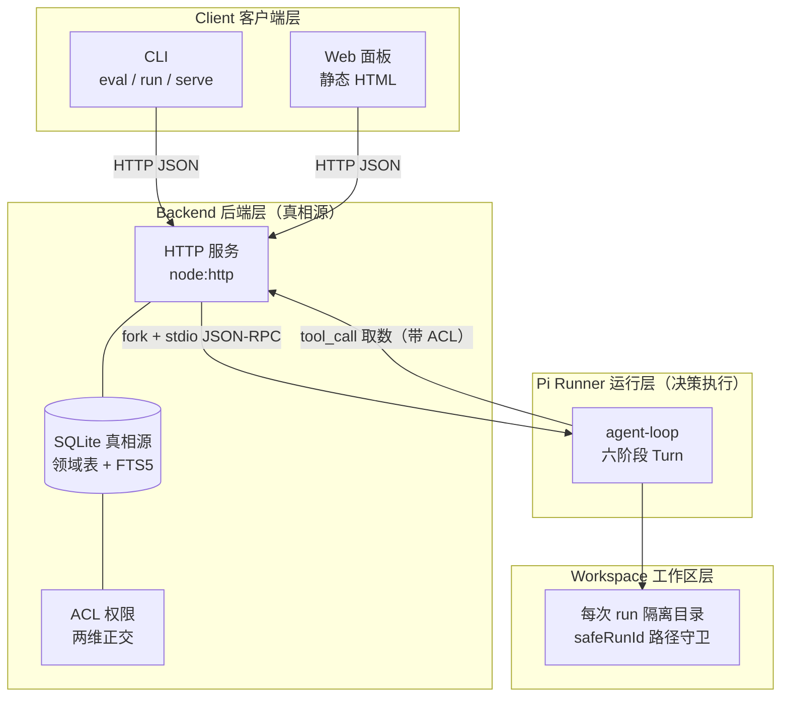

# 零售库存补货决策智能体

> 面向电商库存补货场景的**决策型 Agent**，**基于 MiniClaw 的四层架构（Client / Backend / Pi Runner / Workspace）**：以「定时巡检 → 异常调查 → 审批执行 → 案例复用」的完整闭环替代人工经验补货，把缺货与积压风险前置为**可追溯的决策证据**，人工只保留审批权与参数校准权。

- **照搬 MiniClaw 协议层 + 载体适配**：5 个纯协议/类型文件源码照搬，Docker 容器 runner 改编为 `child_process.fork` + stdio JSON-RPC，`npm install` 零 native 编译
- **离线确定性内核**：20 条本地 case 可离线 100% 复现，无 API Key、无随机性
- **可插拔 LLM 端口**：默认确定性内核，配置凭据即可切换到 OpenAI 兼容模型
- **单机可跑**：`npm run eval` 一键跑完 20 条 case + 回归门禁，`npm run serve` 起 Web 面板

---

## 核心能力

| 模块 | 解决什么 | 关键机制 |
|---|---|---|
| **四层架构** | 决策进程与真相源解耦、越权风险隔离 | Client（CLI+Web）→ Backend（HTTP+SQLite）→ Pi Runner（fork 子进程 agent-loop）→ Workspace（run 隔离目录），Backend 不解读 prompt、Runner 不连 DB |
| **库存数据 Tool Hub** | 多系统库存口径不一、缺货判断失真 | 统一 BI/ERP/库存/销量/促销 Adapter 为 JSON Schema，注册为按 SKU 授权的 MCP Tool，Session 工具面裁剪 |
| **补货 Workflow Runtime** | 人工补货凭经验、决策不可追溯 | Monitor→Detect→Investigate→Decide→Act→Review 六阶段可恢复 Turn，同 SKU 串行，审批后从 Checkpoint 恢复，幂等防重复执行 |
| **定时巡检调度器** | 人工巡检遗漏、市场突变反应慢 | Cron 双层模型：`next_run` 游标兼乐观锁、`occurrence_key` 幂等物化；重启后周期任务 missed 不补跑、一次性任务必达 |
| **审批权限 Harness** | AI 动作越权风险 | ACL 两维正交矩阵：查询/建议 AUTO，补货单/调价/下架 APPROVAL，删除 BLOCKED；admin 工作区层无旁路 |
| **补货 Case Memory** | 历史处置经验不复用 | 案例三段式 Schema，revision CAS 防并发覆盖，FTS5 trigram 按 SKU+时间窗召回 |
| **补货 Trace Eval** | 预测与决策不可复盘 | 六类故障样例，StreamEvent 记录 Tool Calling 与证据链，Regression Gate 三项断言阻断回归 |

## 架构（MiniClaw 四层映射）



四层各司其职，边界清晰：

1. **Client（客户端层）**：CLI 三个命令 + 静态 Web 面板，只做交互与展示，不碰数据。
2. **Backend（后端层）**：HTTP + SQLite 真相源 + Runner 管理。**只落账、取数、审批，不解读 prompt、不跑工具**。
3. **Pi Runner（运行层）**：`fork` 子进程里的 agent-loop，跑决策 Turn。**不连数据库**——取数通过 `tool_call` IPC 向 Backend 请求（带 ACL）。
4. **Workspace（工作区层）**：每次 run 一个隔离目录，路径守卫防目录穿越。

> `Backend ↔ Runner` 的 stdio JSON-RPC（request / response / notification）是 **MCP 协议的同构原型**：Runner 取数只能走带授权的 tool_call，与直连数据库的旧单体设计根本不同。

## 快速开始

```bash
# 要求 Node >= 22.5（内置 node:sqlite）
npm install

# 跑全部 20 条 case + 四层架构测试 + 回归门禁
npm test

# 只看 20 条 case 的评测表格
npm run eval

# 跑一个进程内演示巡检（生成 data/app.db）
npm run run

# 起 Web 面试演示面板（默认 4610 端口，http://localhost:4610）
npm run serve
# 换端口： npm run serve -- 8080
```

## 20 条本地 case

`npm run eval` 会依次执行并在终端打印评测表格。六类故障样例与关键机制覆盖如下：

| # | case | 类别 | 验证点 |
|---|---|---|---|
| 01 | 正常缺货生成补货单 | 正常路径 | 缺货 → 补货建议 → 审批执行 |
| 02 | 积压调价清库存 | 正常路径 | 积压 → 调价建议 |
| 03 | 库存正常无动作 | 正常路径 | 无异常不动作 |
| 04 | 促销中库存正常不误报 | **缺货误报** | 促销抢光 ≠ 缺货 |
| 05 | 促销跌破安全库存仍报警 | 缺货检测 | 促销硬底线 |
| 06 | SKU 错配阻断处置 | **SKU 错配** | 身份不一致即阻断 |
| 07 | 销量口径冲突阻断 | 数据契约 | 多系统口径冲突先排除 |
| 08 | 促销叠加毛利计算不误伤 | **促销叠加** | 叠加折算毛利仍达标 |
| 09 | 毛利为负拦截补货建议 | **毛利约束冲突** | 负毛利建议被拦 |
| 10 | 审批拒绝不自动重试 | **审批拒绝** | rejected 不重试 |
| 11 | 审批后从断点恢复不重跑调查 | 审批恢复 | Checkpoint 续跑 |
| 12 | 工具重试不重复副作用 | **工具重试** | 重试成功且副作用一次 |
| 13 | 重复审批幂等不重复下单 | 幂等控制 | 副作用只执行一次 |
| 14 | 周期巡检重启 missed 不补跑 | 定时调度 | 周期 missed 跳过 |
| 15 | 一次性任务重启必达补跑 | 定时调度 | 一次性必达 |
| 16 | 案例并发写入 CAS 冲突 | Case Memory | revision 冲突 409 |
| 17 | FTS5 按 SKU 召回相似案例 | Case Memory | 精确召回 |
| 18 | 复用历史调查路径 | Case Memory | 复用有效案例 |
| 19 | 未授权 SKU 工具被拒 | ACL 权限 | fail-closed |
| 20 | admin 工作区资源层无旁路 | ACL 权限 | 判断不读 role |

## 项目结构

```
src/
├── client/             # Client 客户端层：Web 面板 + serve 命令
├── backend/            # Backend 后端层：真相源 + HTTP + Runner 管理
│   └── protocol/       #   —— 照搬 MiniClaw 的 5 个纯协议/类型文件
│       ├── stream-event.types.ts   # 流式事件类型（24 种 StreamEventType）
│       ├── permissions.ts          # 平台级系统权限（角色 → 默认权限）
│       ├── ipc-send-dedup.ts       # IPC 发送去重（幂等投递）
│       ├── liveness.ts             # Runner 存活竞态约束（超时数学关系）
│       └── ipc-delivery.ts         # 顺序恢复 / 回执校验 / Turn 追踪
├── runner/             # Pi Runner 运行层：fork 子进程 agent-loop
│   ├── spawn.ts        #   child_process.fork + stdio JSON-RPC（Docker 容器 runner 的载体适配）
│   ├── agent-loop.ts   #   六阶段 Turn 决策循环
│   ├── worker.ts       #   子进程入口
│   └── protocol.ts     #   request/response/notification 编解码
├── workspace/          # Workspace 工作区层：run 隔离目录 + 路径守卫
├── contract/           # 数据契约：领域类型 + JSON Schema
├── adapters/           # 五类源系统 Adapter + 归一化物化
├── tools/              # Tool Registry + 库存 MCP Tool（按 SKU 授权）
├── acl/                # 两维正交 ACL 权限矩阵
├── scheduler/          # Cron 双层调度器
├── runtime/            # Turn 状态机 + Ledger + 幂等 + 审批 + Workflow
├── memory/             # Case Memory（CAS + FTS5）
├── agent/              # 决策内核（detect/decide）+ LLM 端口
├── eval/               # StreamEvent + 断言 + 20 条 case + 回归门禁
└── db/                 # SQLite 连接 + Schema（约束下沉到 CHECK/UNIQUE）
test/
├── cases.test.ts       # 20 条 case 全量验收
└── unit/               # 各模块单元测试（含 four-layer 四层架构集成测试）
```

## 更多文档

- [架构与设计取舍](docs/ARCHITECTURE.md)
- [MiniClaw 源码照搬与载体适配映射](docs/MINICLAW-MIGRATION-MAP.md)
- [面试问答速查](docs/INTERVIEW-QA.md)

## License

MIT